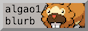

## About Me

I am a 4th year CS student at the [University of Waterloo](https://uwaterloo.ca).

I use my website to document things I've been thinking about or have been doing.

|              |                                                       |
| ------------ | ----------------------------------------------------- |
| **Email**    | `[firstName][at][this fqdn]`                          |
| **GitHub**   | [sean01zhang](https://github.com/sean01zhang)         |
| **LinkedIn** | [in/sean01zhang](https://linkedin.com/in/sean01zhang) |

--- 

## Posts



---
## Widgets
### 88x31

A small pool of buttons (specifically 88px in width and 31px in height) that link to friends, in lexicographic order.

[Tiger](https://zerotiger.ca) told me that https://eightyeightthirty.one/ crawls the entire web for buttons that link to other buttons. Really cool!

   

### Web Rings

A circular linked-list of websites that share some interest in common. Below is the UWaterloo CS webring:

