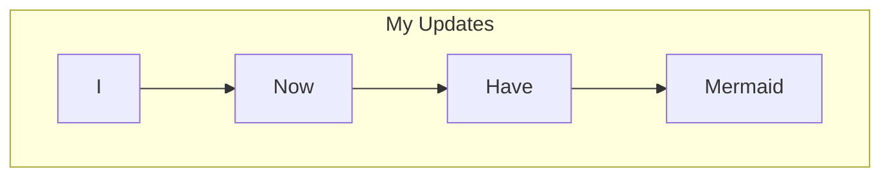

+++
title = "Mermaid Diagrams"
date = 2024-11-30T17:58:43-05:00
draft = false
tags = ['update', 'microblog']
+++

[Mermaid](http://mermaid.js.org/) support woohoo! Hopefully this doesn't blow up my webpage size.

